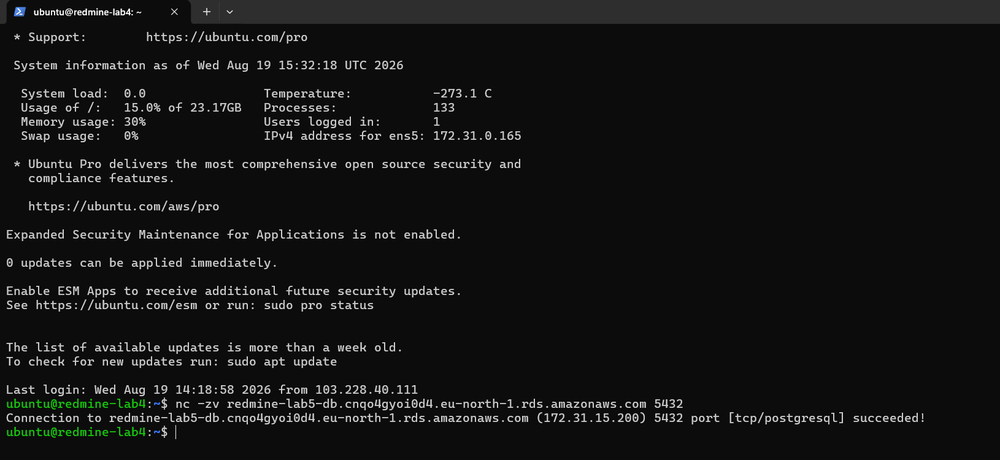
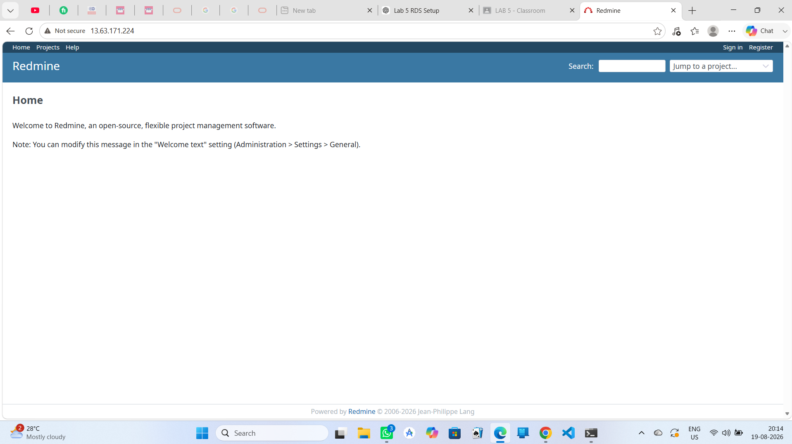

# Cloud Computing Lab 5 – Assignment 1

## AWS RDS PostgreSQL Integration with Redmine on EC2

**Student:** Santo Xavier  
**Roll No.:** 10699  
**Class:** T.E. Computer Engineering – COMPS B  
**Subject:** Cloud Computing  
**Academic Year:** 2026–2027

---

## 1. Objective

The objective of this assignment is to deploy an AWS RDS PostgreSQL database and connect it to the Redmine application deployed on the Lab 4 Amazon EC2 instance.

The assignment demonstrates:

- AWS RDS PostgreSQL deployment
- Secure EC2-to-RDS connectivity
- Migration of the existing Lab 4 Redmine PostgreSQL database to RDS
- Redmine application connectivity with RDS
- Create, Read, Update and Delete (CRUD) operations
- Security Group based database access control

---

## 2. Architecture

The application architecture used for this assignment is:

```text
                    Internet / Client
                           |
                           | HTTP : 80
                           v
                 +----------------------+
                 |   Amazon EC2         |
                 |   redmine-lab4       |
                 |                      |
                 |   Nginx : 80         |
                 |       |              |
                 |       v              |
                 |   Redmine / Puma     |
                 |   127.0.0.1:3000    |
                 +----------+-----------+
                            |
                            | PostgreSQL : 5432
                            | SSL
                            v
                 +----------------------+
                 |   Amazon RDS         |
                 |   PostgreSQL         |
                 |   redmine-lab5-db    |
                 |   Database: lab5db   |
                 +----------------------+

---

## 3. AWS RDS Deployment

An Amazon RDS PostgreSQL instance named `redmine-lab5-db` was deployed for the Lab 5 assignment.

### RDS Configuration

- **Database Engine:** PostgreSQL
- **DB Instance Identifier:** `redmine-lab5-db`
- **Database Name:** `lab5db`
- **Port:** `5432`
- **Purpose:** Store the Redmine application database externally from the EC2 instance.

### RDS Evidence


---

## 4. RDS Security Configuration

A dedicated security group `rds-lab5-sg` was configured for the RDS instance.

The inbound PostgreSQL rule allows access **only from the EC2 Security Group** used by the Redmine EC2 instance.

No `0.0.0.0/0` inbound rule was configured for PostgreSQL.

This ensures that the database is not directly accessible from the public internet.

### Security Configuration Evidence


---

## 5. EC2 to RDS Connection

The existing Redmine application from Lab 4 was configured to use the PostgreSQL database hosted on Amazon RDS.

The Redmine application runs on the EC2 instance using:

- **Nginx:** Port 80
- **Redmine/Puma:** Port 3000 internally
- **RDS PostgreSQL:** Port 5432

The EC2 instance communicates with RDS through the private AWS network using the configured Security Group rule.

### Connection Evidence



---

## 6. Redmine Application Running

The Redmine application was successfully started on the Lab 4 EC2 instance and accessed through the EC2 public IP.

The application was available through Nginx on HTTP port 80.

### Application Evidence



---

## 7. CRUD Operations

The application was used to demonstrate all four mandatory CRUD operations using the RDS-backed Redmine application.

### 7.1 Create

A new record/issue was created successfully through the Redmine application.


### 7.2 Read

The created record was successfully displayed and retrieved from the database.


### 7.3 Update

The existing record was modified successfully through the application.


### 7.4 Delete

The record was successfully deleted through the application.


---

## 8. Security

The following security measures were implemented:

1. RDS PostgreSQL uses port `5432`.
2. RDS inbound access is restricted to the EC2 Security Group.
3. PostgreSQL is not exposed using `0.0.0.0/0`.
4. The Redmine application is accessed through Nginx on port `80`.
5. The database is accessed by the EC2-hosted application rather than directly by external clients.

---

## 9. EC2 Application URL

The deployed Redmine application can be accessed at:

**http://13.63.171.224/**

---

## 10. Repository

GitHub Repository:

**https://github.com/SAnto-spec/cloud-computing-lab5-rds-redmine-10699**

The repository contains the README, AWS configuration evidence, application evidence and CRUD screenshots.

---

## 11. Conclusion

AWS RDS PostgreSQL was successfully deployed and integrated with the Redmine application running on the Lab 4 EC2 instance. The RDS database was secured by allowing PostgreSQL access only from the EC2 Security Group.

The running application successfully demonstrated all four mandatory CRUD operations — Create, Read, Update and Delete — using the RDS-backed database.

Thus, the requirements of **Cloud Computing Lab 5 – Assignment 1** were successfully completed.
